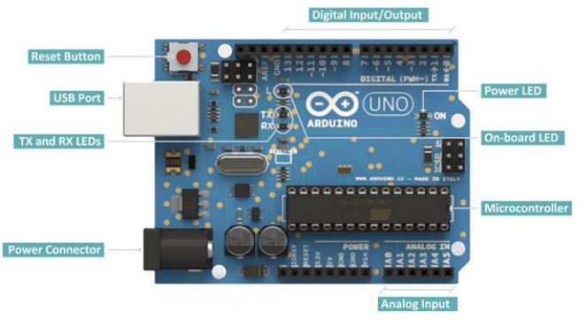
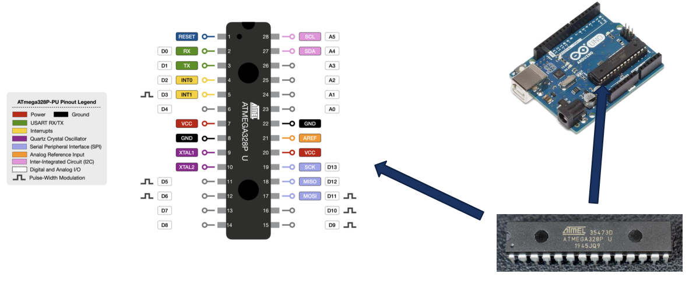
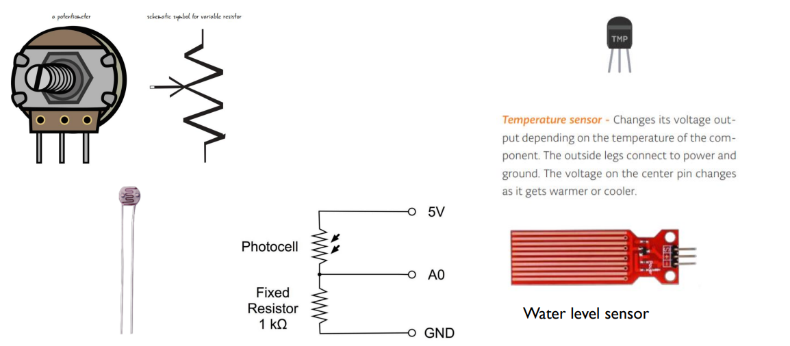

# Sensors With Arduino Development Board 

    Module Code: GEEN1064

    Module Name: Engineering Design and Implementation

    Lecturer: Seb Blair BEng(H) PGCAP MIET MIHEEM FHEA

---

## What is (and is not) A Microcontroller (µC) PT 1

- A µC is a small, self-contained computer that is housed on asingle integrated circuit, or microchip.

- They differ from your desktop computer in that they are typically dedicated to a single function, and are most often embedded in other devices (e.g. mobile phones; household electronics).

- A µC is an Integrated Circuit (IC) device used for controlling other portions of an electronic system

- These devices are optimized for embedded applications that require both processing functionality and agile, responsive interaction with digital, analogue, or electromechanical components.

---

## What is (and is not) A Microcontroller (µC) PT 2

- “µC” is a well-chosen name because it emphasizes defining characteristics of this product category. The prefix “µ” implies smallness and the term "controller" here implies an enhanced ability to perform control functions.

-  As stated above, this functionality is the result of combining a digital processor and digital memory with additional hardware that is specifically designed to help the µC interact with other components.

---

## Arduino Uno

Prototype Board from Arduino
- The Uno is a µC development board with an Atmega328P Chip
- 14 digital Input/Output (I/O) pins
- 6 Analogue I/O pins (e.g. temperature sensors)
- A 16 MHz quartz crystal

---

## ATMega-328P Chip

---

## Signals

- **Digital**
  - value is either HIGH or LOW ( on/off, one/zero) e.g. switch state

- **Analogue**
  - value ranges, usually from 0-255. e.g. LED brightness, motor speed, etc.

---

## Analogue Sensors

---

## Digital Sensors

---

## Digital To Analogue Conversion With Pulse Width Modulation (PWM)

- Computer cannot output analogue signal
    - Usually digital 0 or 5 volt

- But this can be faked by PWM
    - by averaging digital signal flipping between two values

- The duty cycle is defined as the ratio between the pulse duration, or pulse width and the period of a rectangular waveform and measured in percentage